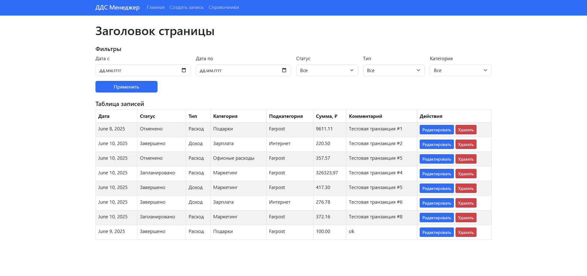

# 💼 Django-проект: Управление ДДС (Денежными Средствами)

Приложение позволяет создавать, редактировать, удалять и фильтровать финансовые транзакции по дате, статусу, типу, категории и подкатегории.



## Установка и запуск

1. Клонируйте репозиторий:

```
git clone <URL вашего репозитория>
cd <имя проекта>
```
2. Установите зависимости:
```
pip install -r requirements.txt
```

3. Создайте файл *.env* и добавьте в него переменные окружения (см. ниже)

4. Выполните миграций и запустите сервер:
```
python manage.py migrate
python manage.py runserver
```
## Страницы
- `index` a.k.a `Главная` - Главная страница со всеми транзакциями с возможностью отфильтровать, редактировать и удалить транзакций.

- `form` a.k.a `Справочники` - Страница с Категориями, Типами и Статусами.

- `create` a.k.a `Создать запись` - Страница на которой вы добавляете транзакцию.


## Переменные окружения

```
ALLOWED_HOSTS=Добавленные хосты
SECRET_KEY=Секретный ключ джанго 
DEBUG=Дебаг(Default True)
```

## !ВНИМАНИЕ BETA!

Настоятельно рекомендую использовать предоставленные тестовые данные или заполнять их через админку, т.к страница со Справочниками т.е `form` доделана не полностью, и на данный момент на ней не получится создать Категорий, Подкатегорий, Статус и Типы. Причина по которым эта страница доделана не полностью заключается в дедлайнах от заказчика. В скором времени все будет готовоБ спасибо за понимание!

[Тестовые данные](https://github.com/manilotw/test-data-DSS)

- логин - `admin`
- пароль - `1`
